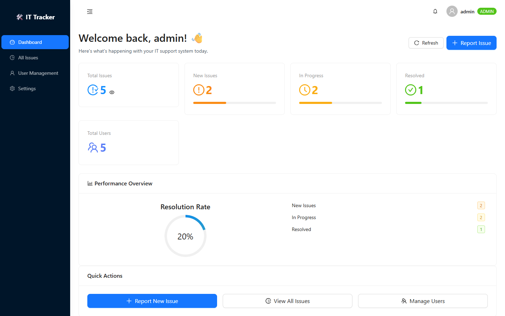
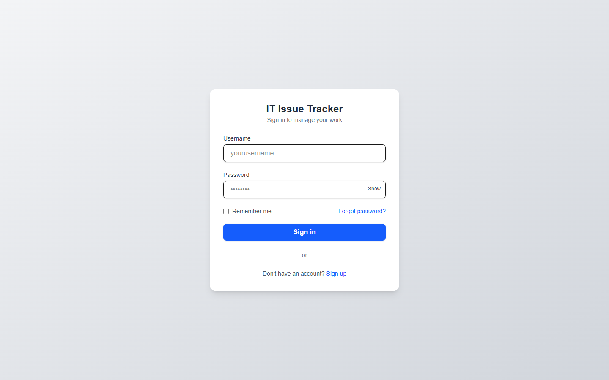
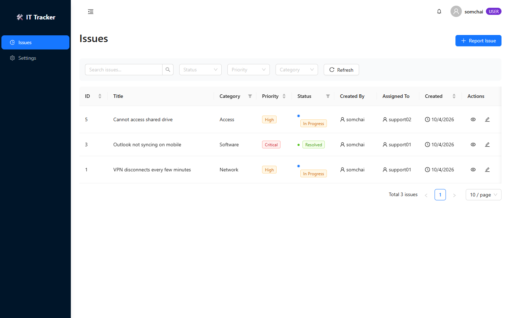

# IT Issue Tracker

A real-time IT ticketing system built with **Next.js 15**, **Socket.IO**, **Prisma** and **PostgreSQL**.
Admins, support staff and end users each get their own permissions, updates arrive live over WebSockets,
and issue events can be pushed to other systems through HMAC-signed webhooks. Runs locally with one `docker compose up`.



## Features

- **JWT authentication** – bcrypt-hashed passwords, HS256 tokens that expire after 24 h
- **Role-based access control** – three roles (`admin`, `support`, `user`), checked in every API route
- **Issue workflow** – create and prioritise issues (Low → Critical), assign them to support staff, and move them through `New → In Progress → Resolved`
- **Real-time notifications** – a Socket.IO server that verifies the JWT during the handshake and pushes events to per-user and per-role rooms
- **Signed webhooks** – optional outgoing webhooks on issue events, signed with HMAC-SHA256 and a timestamp to block replays
- **One-command setup** – Docker Compose starts PostgreSQL and the app, applies the Prisma schema and creates the first admin

## Screenshots

| Sign-in | A regular user only sees their own issues |
|---|---|
|  |  |

## Roles & permissions

| Action | `user` | `support` | `admin` |
|---|:---:|:---:|:---:|
| Sign up from the web app | ✅ (always as `user`) | – | – |
| Create issues | ✅ | ✅ | ✅ |
| See issues | own | assigned to them + unassigned | all |
| Update issue status / details | own | assigned to them + unassigned | all |
| Assign issues to support staff | – | ✅ | ✅ |
| List users | – | admin & support accounts | all |
| Create, edit and delete users / assign roles | – | – | ✅ |
| Send notifications via `/api/notifications` | – | ✅ | ✅ |

## Tech stack

Next.js 15 (App Router) · React · TypeScript · Ant Design · Tailwind CSS · Socket.IO · Prisma ORM · PostgreSQL 15 · jsonwebtoken · bcryptjs · Docker Compose

## Architecture

```text
 Browser (Next.js UI) ──HTTP──▶  server.js  (custom Node server)
        ▲                          ├─ Next.js API routes  /api/*  ──Prisma──▶  PostgreSQL
        │                          └─ Socket.IO  (JWT handshake, user_<id> / role_<role> rooms)
        └──────── WebSocket ◀──────┘
                                   API routes ──HMAC-signed POST──▶ WEBHOOK_URL (optional)
```

## Getting started

**Requirements:** Docker with Docker Compose, and `bash` (on Windows, Git Bash works).

```bash
git clone https://github.com/chaiwat-come/ITTracking.git
cd ITTracking

# 1. Create .env with random secrets (database password, JWT secret, admin password)
bash scripts/init-env.sh

# 2. Build and start PostgreSQL + the app (the first build takes a few minutes)
docker compose up --build
```

Open **http://localhost:3000** and sign in as `admin` with the `ADMIN_PASSWORD` printed in step 1 (it is also stored in `.env`).

To open a SQL shell on the database: `docker exec -it ittracker_postgres psql -U postgres -d ittracker`

Optional – create demo `support01`, `support02` and `user` accounts (password = `DEMO_PASSWORD` in `.env`):

```bash
bash scripts/create-users.sh            # or, in PowerShell: .\scripts\create-users.ps1
```

### Play with Docker

1. Open [Play with Docker](https://labs.play-with-docker.com/) and click **Add New Instance**
2. Run:
   ```bash
   git clone https://github.com/chaiwat-come/ITTracking.git && cd ITTracking
   bash scripts/init-env.sh
   docker compose -f docker-compose.pwd.yml up --build
   ```
3. Click the **3000** badge at the top of the page to open the app

### Running without Docker

Needs Node.js 20.6+ and a running PostgreSQL.

```bash
bash scripts/init-env.sh        # then point DATABASE_URL in .env at your database
npm install
npx prisma db push
node scripts/seed-admin.js
npm run dev
```

## API overview

All protected routes expect `Authorization: Bearer <token>`.

| Method | Endpoint | Who | Description |
|---|---|---|---|
| `POST` | `/api/auth/register` | anyone (creates a `user`) · admin token to assign `support`/`admin` | Create an account |
| `POST` | `/api/auth/login` | anyone | Returns a JWT |
| `GET` | `/api/issues/iss` | signed in | List issues, scoped by role. Filters: `status`, `category`, `priority`, `assignedTo`, `search` |
| `POST` | `/api/issues/iss` | signed in | Create an issue |
| `GET` / `PATCH` | `/api/issues/:id` | signed in (role rules apply) | Get or update an issue |
| `GET` | `/api/users` | admin, support | List users |
| `POST` | `/api/users` | admin | Create a user with a role |
| `PUT` / `DELETE` | `/api/users/:id` | admin | Update or delete a user |
| `GET` / `POST` | `/api/notifications` | signed in / admin, support | WebSocket status / send a notification |
| `POST` | `/api/webhook/test` | `X-Signature` header | Verify a signed webhook (for testing) |

```bash
# Log in as admin and keep the token
TOKEN=$(curl -s -X POST http://localhost:3000/api/auth/login \
  -H 'Content-Type: application/json' \
  -d '{"username":"admin","password":"<ADMIN_PASSWORD>"}' | sed -n 's/.*"token":"\([^"]*\)".*/\1/p')

# Create a support account - without the admin token this returns 403
curl -X POST http://localhost:3000/api/auth/register \
  -H "Authorization: Bearer $TOKEN" -H 'Content-Type: application/json' \
  -d '{"username":"support01","password":"<password>","role":"support"}'

# Create an issue
curl -X POST http://localhost:3000/api/issues/iss \
  -H "Authorization: Bearer $TOKEN" -H 'Content-Type: application/json' \
  -d '{"title":"Printer offline","description":"3rd-floor printer is not responding","priority":"High"}'
```

## Real-time events

| Event | Sent to | When |
|---|---|---|
| `connected` | the connecting user | the JWT handshake succeeded |
| `issue_created` | `admin` and `support` role rooms | a new issue is created |
| `issue_updated` | the user who created the issue | someone else changes its status |

To check the connection, sign in, open the browser console and run `window.socket?.connected` – it should print `true`.

## Webhooks

Outgoing webhooks are **off by default**. Set both `WEBHOOK_URL` and `WEBHOOK_SECRET` in `.env` to turn them on.
The app sends `issue.created` and `issue.updated` (status changes) with this body:

```json
{ "event": "issue.updated", "issue_id": 12, "new_status": "Resolved", "updated_by": "support01" }
```

Each request carries `X-Signature: t=<unix-timestamp>,hmac=<hex>`, where the HMAC is
`HMAC_SHA256(WEBHOOK_SECRET, "<timestamp>.<raw body>")`. A receiver should recompute it, compare in constant time
and reject timestamps older than 5 minutes.

To try it locally, run the bundled receiver and point the app at it:

```bash
WEBHOOK_SECRET=<same secret as .env> node webhook-test-server.js     # listens on :4000/webhook
# in .env:  WEBHOOK_URL=http://host.docker.internal:4000/webhook
```

## Security notes

- Passwords are hashed with bcrypt; JWTs are signed with HS256 (algorithm pinned) and expire after 24 h
- Secrets only come from the environment (`.env` is git-ignored); the server refuses to start without `JWT_SECRET`
- Public sign-up can only create `user` accounts – only an admin can grant `support` or `admin`
- Every API route checks the caller's role, and issue listing is scoped per role (search cannot widen it)
- Webhooks are signed with HMAC-SHA256 plus a timestamp, and are disabled unless explicitly configured
- PostgreSQL is not published to the host – only the app container can reach it (so it also never clashes with a local PostgreSQL)

## Project structure

```text
├── server.js                  # custom Node server: Next.js + Socket.IO (JWT handshake, rooms)
├── prisma/schema.prisma       # User and Issue models
├── scripts/
│   ├── init-env.sh            # creates .env with random secrets
│   ├── seed-admin.js          # creates the first admin on startup
│   └── create-users.sh|.ps1   # demo support/user accounts through the API
├── src/app/api/               # REST API routes (auth, issues, users, notifications, webhook test)
├── src/components/            # IssueForm, IssueList, NotificationBell, WebSocketProvider
├── src/lib/                   # jwt, webhook (HMAC), Prisma client
└── webhook-test-server.js     # local receiver that verifies webhook signatures
```
